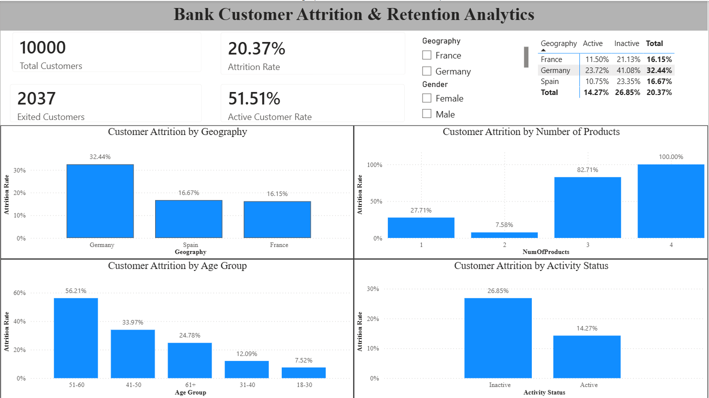

# Bank Customer Attrition & Retention Analytics

An end-to-end data analytics project analyzing bank customer attrition patterns to identify high-risk customer segments and generate actionable retention insights using **Python, SQL, and Power BI**.

---

##  Power BI Dashboard

<p align="center">
  
</p>

---

##  Business Objective

Customer attrition is an important challenge for banks because losing existing customers can negatively impact revenue and customer lifetime value.

The objective of this project is to:

- Measure the overall customer attrition rate
- Identify customer segments with higher attrition
- Analyze attrition across demographic and behavioral factors
- Identify high-risk customer segments
- Perform statistical analysis to identify meaningful associations
- Use SQL to answer business questions
- Build an interactive Power BI dashboard
- Translate analytical findings into actionable retention recommendations

---

##  Tools & Technologies

| Tool | Purpose |
|---|---|
| **Python** | Data cleaning, EDA and statistical analysis |
| **Pandas** | Data manipulation |
| **NumPy** | Numerical analysis |
| **Matplotlib** | Data visualization |
| **SQL / MySQL** | Business analysis and segmentation |
| **Power BI** | Interactive dashboard and KPI reporting |
| **Jupyter Notebook** | Analysis workflow |

---

##  Project Structure

```text
Bank Customer Descriptive Analytics/
│
├── data/
│   ├── raw/
│   │   └── bank_churn.csv
│   └── processed/
│       └── bank_customer_analysis.csv
│
├── notebooks/
│   └── Bank_Customer_Analysis.ipynb
│
├── powerbi/
│   └── Bank_Customer_Attrition_Dashboard.pbix
│
├── sql/
│   └── 01_customer_analysis.sql
│
├── images/
│   └── dashboard.png
│
├── .gitignore
└── README.md
